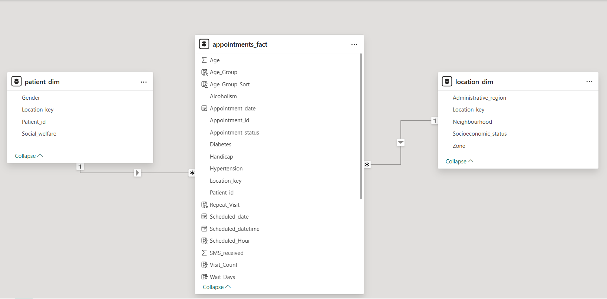

# Healthsure-Appointments
Analyzing 110K+ healthcare appointments to uncover why patients miss visits. Built a clean MySQL database, enriched it with location and socioeconomic details, and designed an interactive Power BI dashboard for quick, clear insights that help clinics act fast.

---

## 📌 Table of Contents
1. [Project Overview](#1-project-overview)
2. [Business Problem](#2-business-problem)
3. [Objectives](#3-objectives)
4. [Dataset](#4-dataset)
5. [Technical Workflow](#5-technical-workflow)
    - [Data Preparation in MySQL](#a-data-preparation-in-mysql)
    - [Dimensional Modelling](#b-dimensional-modelling)
    - [Data Enrichment](#c-data-enrichment)
    - [Power BI Connection & Transformation](#d-power-bi-connection--transformation)
    - [Dashboard Development](#e-dashboard-development)
6. [Key Features of the Solution](#6-key-features-of-the-solution)
7. [Power BI Pages Overview](#7-power-bi-pages-overview)
8. [Insights & Recommendations](#8-insights--recommendations)
9. [Skills Demonstrated](#9-skills-demonstrated)
10. [Next Steps](#10-next-steps)

---


---
## 1. Project Overview
This project is an **end-to-end Business Intelligence workflow** for a healthcare organization, *Healthsure Clinics*, aiming to understand and improve patient attendance rates for scheduled appointments.

The project covers:
- **Data acquisition & staging** (MySQL)
- **Data modeling** into a **Star Schema**
- **Data cleaning & enrichment** (Neighborhood → Region, Zone, Socioeconomic status)
- **Indexing & referential integrity** for query performance
- **Data visualization & storytelling** in Power BI
- **Actionable insights** for operational improvement

> 🔗 **[View the Live Power BI Dashboard](https://app.powerbi.com/groups/me/reports/9b688526-2520-4096-8033-992822866b65/2376429563721e811450?ctid=3c32c29c-85ba-45ef-9a06-92fcd610a8d2&experience=power-bi)** – Fully interactive report with filters.
---

## 2. Business Problem
Missed appointments (no-shows) create significant **financial and operational strain** for healthcare providers, leading to:
- Wasted staff time and resources
- Reduced patient access to care
- Lower operational efficiency

The clinic wanted to **analyze historical appointment patterns** to answer:
- Who misses appointments?
- Where do missed appointments occur most?
- When are appointments most likely to be missed?
- How do socioeconomic factors impact attendance?

---

## 3. Objectives
- Build a **relational database** to store and manage appointment records.
- Create a **fact table** and **dimension tables** for patient, location, and appointment details.
- Enrich location data with **zones** and **socioeconomic status** for deeper analysis.
- Develop an **interactive Power BI report** with filters, KPIs, and visuals for different stakeholders.
- Provide **actionable recommendations** to reduce no-show rates.

---

## 4. Dataset
- **Source:** Public dataset from Brazil's medical appointment records, cleaned and transformed.
- **Size:** 110,527 appointment records.
- **Key Columns:**
    - Appointment ID, Patient ID
    - Scheduled Date, Appointment Date
    - Patient demographics (age, gender, conditions)
    - SMS reminders received
    - Neighborhood, administrative region
    - Appointment status (Show / No-Show)

---

## 5. Technical Workflow

### A. Data Preparation in MySQL
1. **Imported raw CSV into staging table** `stg_appointments`.
2. Standardized column names and data types.
3. Converted text cases for matching (e.g., `NEIGHBOURHOOD` from UPPERCASE → Proper Case).
4. Created indexes for faster joins:
```sql
CREATE INDEX idx_stg_appointments_neighbourhood 
    ON stg_appointments(Neighbourhood);

CREATE INDEX idx_location_neighbourhood 
    ON location_dim(Neighbourhood);
```
### B. Dimensional Modelling
Created a **Star Schema** with:

**Fact Table:**
- `appointments_fact`  
  *(AppointmentID, PatientID, LocationKey, dates, patient conditions, appointment status)*

**Dimension Tables:**
- `patient_dim`  
  *(PatientID, Gender, LocationKey, SocialWelfare)*
- `location_dim`  
  *(LocationKey, Neighbourhood, AdministrativeRegion, Zone, SocioeconomicStatus)*

> 
---

### C. Data Enrichment
- Mapped **Neighborhoods → Administrative Regions** using official region data.
- Added `Zone` and `SocioeconomicStatus` columns to `location_dim`.
- Updated `location_dim` via CSV mapping and SQL `UPDATE` statements.

---

### D. Power BI Connection & Transformation
- Connected **Power BI** directly to **MySQL** database.
- Converted `PatientID` and `AppointmentID` to **Text** to avoid scientific notation.
- Kept `LocationKey` as **Integer** for relationship joins.
- Converted **Yes/No** columns into binary flags (0/1) where relevant.
- Dropped redundant columns (e.g., `AppointmentDateTime` — always `00:00:00`).
- Renamed columns using underscores for consistency.

---

### E. Dashboard Development

**Theme & Branding:**
- Custom **JSON theme** using clinic's brand colors:
  - Dark Purple `#4b3988` (Text)
  - Light Purple `#433476` (Graphics)
  - Red `#cf3136`
  - Pink `#E37F7C`
- Consistent typography, iconography, and layout.
- Navigation buttons with tooltips for multi-page navigation.
- Mobile-optimized layouts for all pages.

**Navigation:**
- Multi-page report with **Previous/Next** page navigation.
- Tooltips explaining navigation purpose.

---

## 6. Key Features of the Solution
- **Role-specific insights:** Pages tailored for executives, operations managers, and outreach teams.
- **Dynamic filtering:** By gender, socioeconomic status, age group, region, and zone.
- **Trend & distribution analysis:** Patterns over time, by location, and patient demographics.
- **Performance metrics:** No-show rates, show rates, and top/bottom performing areas.

---

## 7. Power BI Pages Overview
1. **Executive Summary** – KPIs, top-level trends, and filters.
2. **Access & Equity** – Socioeconomic and regional disparities.
3. **Patient Profiles** – Demographic & health condition patterns.
4. **Scheduling Patterns** – Booking timing and wait time effects.
5. **Repeat Visits & Loyalty** – Retention and attendance behavior.

---

## 8. Insights & Recommendations
### 1. Access & Equity
***What We Found:*** HealthSure managed 110,527 appointments, with low-income patients making up 75% of visits. No-show rates are high everywhere (~80%), but Santa Martha (84.2%) and Tabuazeiro (81.7%) stand out for both their large appointment volumes and high miss rates.

***What to Do Next:*** Concentrate early action in Santa Martha and Tabuazeiro — a targeted transport assistance and reminder campaign here could recover over 8,000 missed visits annually.

### 2. Geographic Performance
***What We Found:*** Jardim Camburi is the busiest hub (7,717 appointments) but has an 81% no-show rate. Jardim da Penha, while smaller in volume, has the highest miss rate among middle-income areas (83.7%).

***What to Do Next:*** Shift 10% of Jardim da Penha’s appointment slots to Jardim Camburi to reduce wasted capacity and increase throughput where demand is highest.

### 3. Patient Behaviour & Risk
***What We Found:*** Older patients (60–79) miss 85% of their bookings. Patients with diabetes (82.7%) and hypertension (82.6%) are also at higher risk, while those with disabilities show better attendance (72.1%).

***What to Do Next:*** For older and high-risk patients, pre-book follow-ups before they leave the clinic and add a second contact point (call or SMS) 24 hours before the visit.

### 4. Operational Efficiency
***What We Found:*** Mornings (7–9 a.m.) carry 47,385 bookings but have no-show rates of 81–84%. Evenings (7–8 p.m.) have much lower miss rates (67–72%) but only ~1,540 bookings. Attendees wait 12.3 days; no-shows wait 21.5 days.

***What to Do Next:*** Reallocate 15% of morning capacity to evening slots and set a maximum 14-day wait target to improve attendance and reduce idle clinical time.

### 5. Loyalty & Engagement
***What We Found:*** Only 39% of patients return for repeat visits. Welfare patients have better attendance (76.3% no-show) than others (80.2% no-show), and current SMS reminders show no consistent improvement unless multiple reminders are sent.

***What to Do Next:*** Create a priority rebooking program for past attendees and redesign reminder strategies to include multiple touchpoints for high-risk patients

---

## 9. Skills Demonstrated
- **SQL:** Data wrangling, indexing, and optimized joins.
- **Data Modeling:** Star schema design for BI.
- **Data Enrichment:** External data mapping and integration.
- **Power Query:** Model cleanup and transformation.
- **DAX:** KPI measures and calculated metrics.
- **Power BI Design:** Branding, navigation, and mobile views.
- **Storytelling:** Actionable insights using the AND–BUT–THEREFORE framework.

---

## 10. Next Steps
- Integrate **real-time appointment booking feeds**.
- Add **predictive modeling** for no-show likelihood.
- Expand reports to include **financial impact analysis** of missed appointments.

